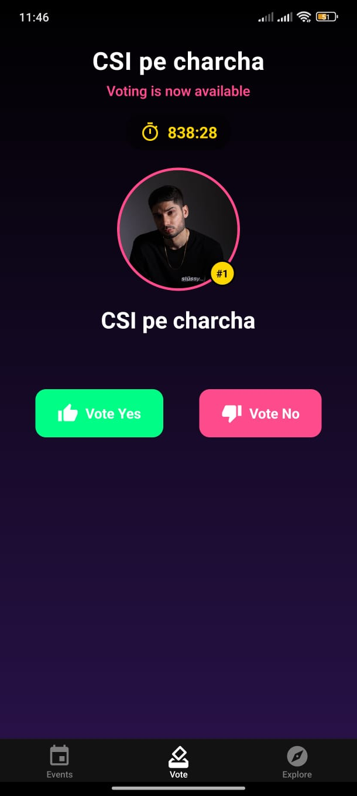
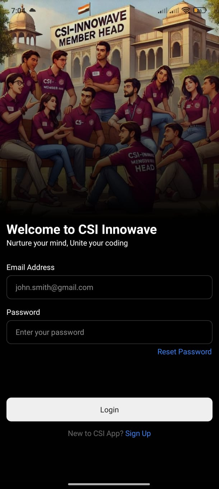

# Zypher: College Event Management Platform
> 
> A full-stack TypeScript mobile application for managing CSI's college events with real-time voting, user profiles, and push notifications.
> Professional event management system built on React Native

<div align="center">
  
</div>

---

## 🎯 Project Overview

An enterprise grade mobile event management platform designed for college societies. The system features a **React Native mobile app** (iOS/Android) powered by a **Node.js backend API**. 


### Core Features

#### <> Authorization:
- **Firebase Authentication** integration for secure user management
- **JWT-based** middleware for protected routes
- Custom `verifyJWT` middleware with Bearer token validation
- Type-safe request augmentation with custom Express types

```typescript
// Type-safe authentication middleware
interface AuthenticatedRequest extends Request {
    user?: JwtPayload | string;
}
```

####  <> Real-Time Voting System
- **Server-Sent Events (SSE) based** for live vote updates
- Unidirectional server-to-client streaming
- Automatic reconnection handling
- Event-driven architecture for vote broadcasts
- Low-latency performance updates without polling

#### <> Database Design

**8 Normalized Models** with relations:

1. **User**: Authentication & profile linkage
   - Email-based unique identification
   - Push notification token management
   - Admin role support

2. **Profile**: Extended user information
   - College, year, program, branch
   - Gender enum type
   - Cascade deletion on user removal

3. **Event**: Event management
   - Rich metadata (performers, venue, type)
   - Registration & rule book links
   - Voting enablement toggle

4. **Performance**: Sub-events within main events
   - Many-to-one relation with Events
   - Real-time voting controls
   - Configurable voting duration

5. **Vote**: User voting records
   - Compound relations (User + Performance)
   - Boolean vote tracking
   - Timestamp auditing
   - Real-time updates via Server-Sent Events (SSE)

#### <> API Patterns

**Generic API Response Handler**
```typescript
class ApiResponse<T> {
    statusCode: number;
    data: T;
    message: string;
    success: boolean;
}
```

**Async Handler Wrapper** (Error boundary for async routes)
```typescript
const asyncHandler = (requestHandler) => {
    return (req, res, next) => {
        Promise.resolve(requestHandler(req, res, next))
            .catch((err) => next(err))
    }
}
```

**Custom Error Classes** with HTTP status codes
```typescript
class ApiError extends Error {
    statusCode: number;
    // ... proper error stack tracing
}
```

### <> Middleware Stack

1. **CORS Configuration**: Environment-based origin control
2. **Body Parsing**: JSON & URL-encoded (50MB limit for images)
3. **Static File Serving**: Public asset management
4. **Request Logging**: Pino-based structured logging
5. **Trust Proxy**: Production-ready reverse proxy support

### <> Deployment

#### Docker Config:

```yaml
services:
  app:
    - TypeScript build process
    - Volume mounting for hot reload
    - Environment variable injection
  
  db:
    - PostgreSQL 13 Alpine (lightweight)
    - Persistent volume storage
    - Localhost-only port binding (security)
```


#### Database Migrations

```bash
npx prisma migrate prod
npx prisma generate
```

## 📱 Mobile Application Architecture

### Tech Stack (React Native)

```typescript
  framework: "React Native (Expo 52)",
  navigation: "Expo Router",
  stateManagement: "Redux Toolkit 2.5",
  authentication: "Firebase Authentication",
  pushNotifications: "Firebase Cloud Messaging",
  uiLibrary: "Tamagui (React Native UI Kit)"
```

### Project Structure


### Mobile App Features

- **Cross-Platform**: Single codebase for iOS & Android
- **Google Sign-In** integration with Firebase
- **Push Notifications** via Firebase Cloud Messaging
- **Redux State Management** for global app state
- **File-based Routing** (Expo Router)
- **Type-Safe API Calls** with Axios interceptors
- **Native Performance** with Expo optimizations

---

## <> Setup

### Prerequisites

```bash
# Required installations
- Node.js 18+
- Docker & Docker Compose
- PostgreSQL 13+ (or use Docker)
- Firebase Project (Admin SDK credentials)
```

### Backend Setup

```bash
# 1. Clone the repository
git clone https://github.com/joyal-jij0/csi-m1.git
cd csi-m1/backEnd

# 2. Install dependencies
npm install

# 3. Configure environment variables
# Create .env file with:
# - DATABASE_URL
# - POSTGRES_USER
# - POSTGRES_PASSWORD
# - ACCESS_TOKEN_SECRET
# - CORS_ORIGIN
# - FIREBASE_ADMIN_SDK_PATH

# 4. Start Docker containers
docker-compose up -d

# 5. Run Prisma migrations
npx prisma migrate dev

# 6. Generate Prisma Client
npx prisma generate

# 7. Start development server
npm run dev
# OR with Docker hot-reload
npm start
```

### Mobile App Setup

```bash
cd csi-m1/frontEnd

# 1. Install dependencies
npm install

# 2. Configure Firebase
# Add google-services.json to root (Android)
# Add GoogleService-Info.plist for iOS
# Update app.json with Firebase config

# 3. Start Expo development server
npm start

# 4. Run on physical device/emulator
npm run android  # For Android
npm run ios      # For iOS (macOS only)

# 5. Scan QR code with Expo Go app on your phone
# OR run on emulator/simulator
```

---

## 📸 Screenshots

<div align="center">
  
  
  
  
</div>

---


- **About CSI**: [Computer Society of India - MAIT](https://csiinnowave.com)
- **Technical Societies at MAIT, Delhi**: [Explore All Societies](https://www.mait.ac.in/index.php/gallery/technical.html)

---
